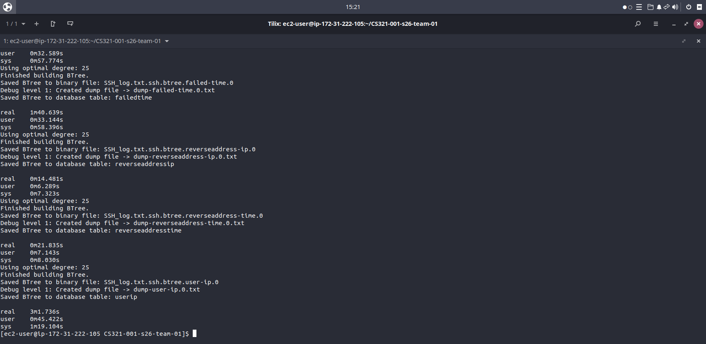
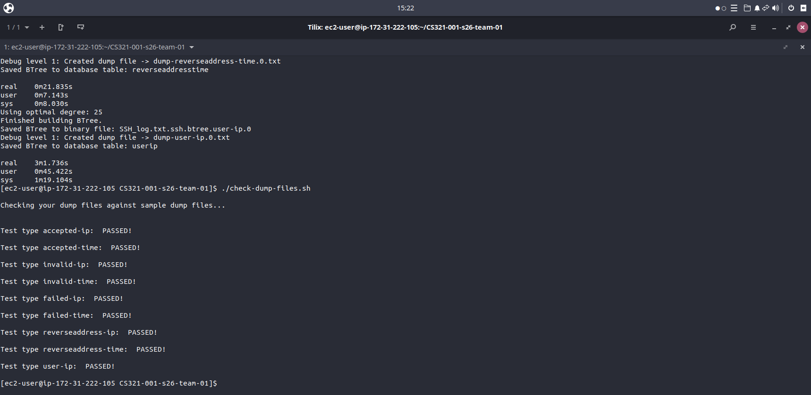
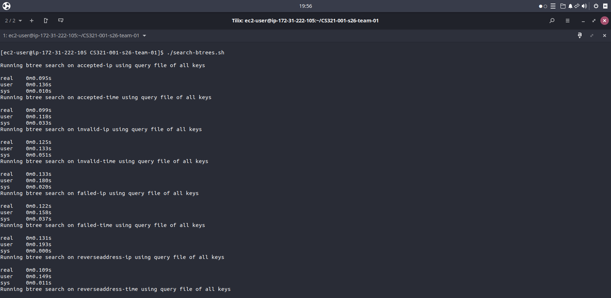
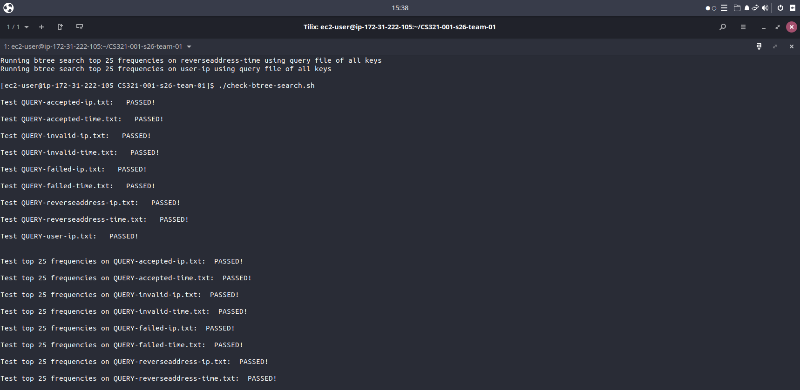
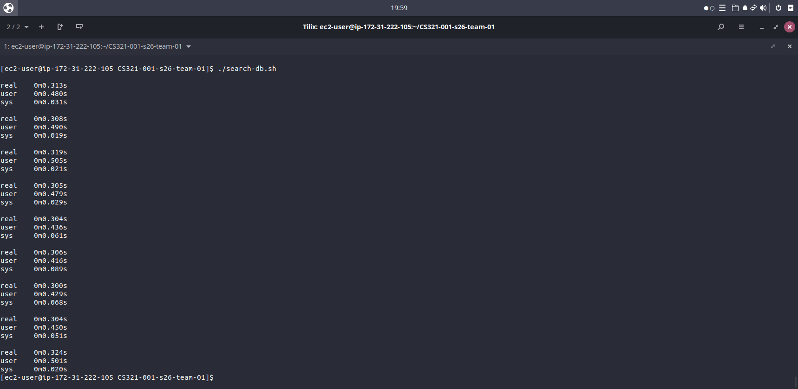
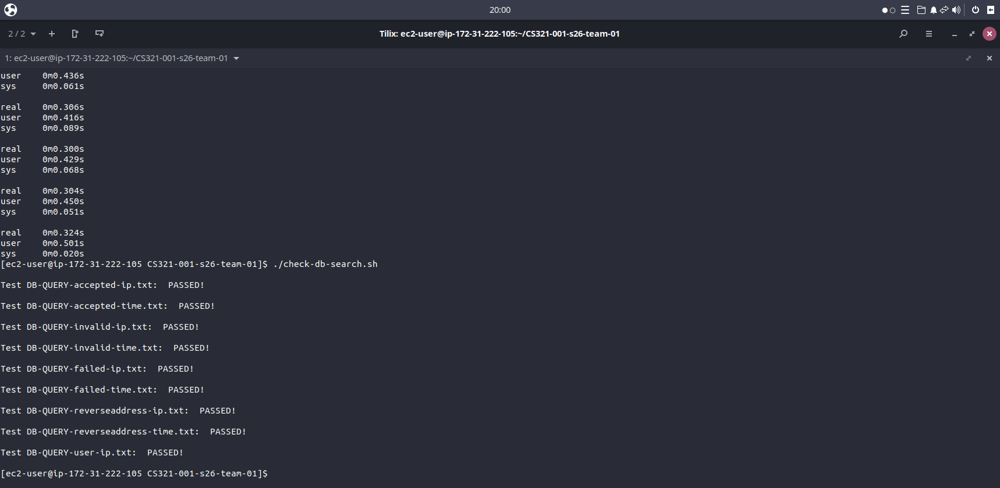

### Team Name

Team 001

## Team Members

-Jonah Elliott
-Jacob Smith
-Tanner Klinge

| Last Name | First Name | GitHub User Name |
|-----------|------------|------------------|
| Elliott   | Jonah      | Jayw-E7          |
| Klinge    | Tanner     | tk-44            |
| Smith     | Jacob      | j-smith05        |

# Test Results

How many of the dumpfiles matched (using the check-dump-files.sh script)?

All of Them

How many of the btree query files' results matched (using the check-btree-search.sh script)?

All of Them

How many of the database query files' results matched (using the check-db-search.sh script)?

All of Them

# AWS Notes

I, Tanner Klinge, set up the AWS instance for multiple reasons. The first being that in project 3, I got AWS up and running,g but I was unable to clone my repository because I didn't properly set up my keys in GitHub. So I really wanted to do this for project 4, so I can understand it fully. When I started setting up AWS, I tried using the same keys and the instance from the last project. This ended up not working out,t so I tried to restart the process, but when I did, I wasn't able to connect to Onyx. So I had to wait until the following day to go talk to the TAss to see what was wrong. I found out that my VM didn't have internet again. Once I got that up and running, I made new keys and was finally able to get it up and running.

# Reflection

The first subsection below should include how the team used AI tools to help with the
project, including which tools were used, how they were used, and any benefits or challenges
Encountered.

Reflect on each of the team members (in a separate subsection for each team member) on
their experience with the project, including what they learned, what they found challenging, and how they overcame those challenges.

## AI Usage

One of the ways in which we used AI was as a tutor that would help us to better understand what we are doing and give a general direction of where we could go. We also used tutor mode prompts that challenged us and quizzed us to gauge our understanding of the subject. Another way in which we used AI was to help with more repetitive tasks, such as when modifying reused code slightly or filling in methods that have clear documentation provided. We also used it to assist with some of the debugging process, especially when tracing issues that are dealing with hundreds of lines of code among multiple files.

## Reflection (Team member name: Jonah Elliott)

This project was intimidating at first, but being on a team made it more manageable. A lot of time was spent just understanding exactly what needs to be done. It was definitely a unique experience compared to other CS projects, as I was working at a higher level with some AI and team assistance, and less time spent doing line-by-line debugging on my own. One disadvantage was not getting to learn the specifics in quite as much depth and not having solved the problems on my own, but this style of development is more manageable for large projects like this one and helps with repetitive, tedious tasks.

## Reflection (Team member name: Jacob Smith)

This project was terrifying in its own right, not super used to working in a team setting, which caused issues of its own for me. It allowed me to manage my time better, as I would’ve struggled to complete this project without a team. But overall, this project was an enjoyable experience and a good resume builder experience, specifically in cybersecurity, which is the field I want to go into. I also just had issues with time management during this last project, as I started an internship, so I was just increasingly busy. But this project taught me valuable skills in time management and teamwork in a big project.

## Reflection (Team member name: Tanner Klinge)

I had some troubles at first when it came to fully understanding the scope of the project. The AI usage for this project helped a lot with the understanding and was great for starting our code. I think some of the biggest issues I ran into was creating the database and fully understanding it's functionality, although after AI was able to explain whats going on, everything cleared up. But in all this project has been a great experience especially since I plan on getting into cybersecurity.

## AWS Testing

We tested our project on an Amazon AWS EC2 instance. Below are screenshots showing all test scripts passing on AWS.

### 1. Create BTrees

### 2. Check Dump Files

### 3. Search BTrees

### 4. Check BTree Search

### 5. Search Database

### 6. Check Database Search

## Late Coupon Usage

    Using of Jacob's Late Coupons for extra day of work.
